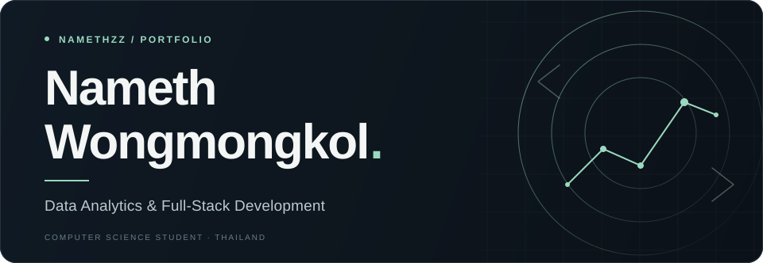

<!-- Upload README.md, nameth-header.svg, and nameth-header-mobile.svg together to the repository root. -->

  <picture>
    <source media="(max-width: 600px)" srcset="./nameth-header-mobile.svg">
    
  </picture>

  <strong>Computer Science &amp; Software Development · Sripatum University</strong>
   
  Thailand &nbsp; · &nbsp; Open to internships in data analytics and software development

  <a href="mailto:nameth.won@spumail.net">Get in touch ↗</a>
  &nbsp;&nbsp; / &nbsp;&nbsp;
  <a href="https://github.com/namethzz?tab=repositories">Explore my projects ↗</a>

 

## About

I work with **data and web applications** — from cleaning datasets and exploring price trends to building interfaces and developing application features.

My projects bring together **data preparation, frontend and backend development, and API testing**. I'm looking for an internship where I can contribute these skills and learn from a development or analytics team.

 

## Selected work

01 &nbsp; / &nbsp; DATA ANALYTICS + WEB DEVELOPMENT

### [THAI เท ↗](https://github.com/namethzz/construction-price-intelligence)

**Construction Price Intelligence** &nbsp; · &nbsp; *In progress*

Exploring historical construction material prices in Thailand, with a focus on **structural materials**.

**My work:** Prepare and clean material price data, analyze monthly changes, and develop the React interface. The project aims to forecast individual material prices **1–3 months ahead**.

  <code>Python</code> &nbsp; <code>Pandas</code> &nbsp; <code>NumPy</code> &nbsp; <code>React</code> &nbsp; <code>Looker Studio</code>

---

02 &nbsp; / &nbsp; FULL-STACK DEVELOPMENT

### [OTW.SHOP ↗](https://github.com/namethzz/OTW)

**Supplement E-Commerce**

A supplement-store web application covering **product discovery, shopping carts, order management, and store administration**.

  <code>C#</code> &nbsp; <code>ASP.NET Core MVC</code> &nbsp; <code>MySQL</code>

---

03 &nbsp; / &nbsp; DATA PREPARATION · TEAM PROJECT

### Economic Crops Chat

**Location-based crop recommendations for Thai farmers**

**My work:** Collected and cleaned agricultural data for **14 crop types**, then organized it by location for a **RAG pipeline**.

  <code>Python</code> &nbsp; <code>MongoDB</code> &nbsp; <code>ChromaDB</code> &nbsp; <code>React</code> &nbsp; <code>Node.js</code>

 

## Skills & tools

| Area | Technologies |
| :--- | :--- |
| **Data & analysis** | Python · Pandas · NumPy · SQL · Looker Studio |
| **Web development** | React · JavaScript · Node.js · C# · ASP.NET Core MVC |
| **Databases** | MySQL · SQL Server · MongoDB · ChromaDB · SQLite |

### Tools

  
  &nbsp;
  
  &nbsp;
  
  &nbsp;
  
  &nbsp;
  

 

## Currently learning

- **Excel** — Spreadsheets and data analysis
- **SQL** — Queries and database fundamentals
- **Data visualization** — Clear charts and dashboards

 

## GitHub Stats

  
  &nbsp;
  

  Activity and language usage across my public repositories.

 

## Let's connect

  <strong>Let's build something useful.</strong>
   
  Open to internships in data analytics and software development.

  
  &nbsp;&nbsp;
  

  
    <a href="mailto:nameth.won@spumail.net">nameth.won@spumail.net</a>
    &nbsp; / &nbsp;
    <a href="https://github.com/namethzz">@namethzz</a>
  

